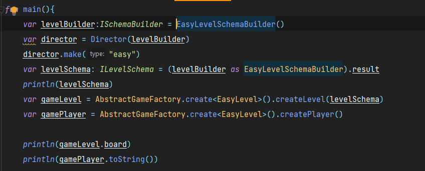
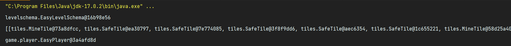

# Creational Design Patterns


## Professor: Mihai Gaidau
## Student: Scripca Lina

----

## Objectives:

* Get familiar with the Creational DPs;
* Implement at least 5 CDPs for a specific domain;


## Used Design Patterns:

* Singleton
* Builder
* Prototype
* Factory Method
* Abstract Factory


## Implementation
The design patterns mentioned earlier have been implemented within the context of a Minesweeper Game builder.
The game builder allows for 2 regimes, easy and hard, requiring different level schemas, boards and player configurations for each.

##### Important Concepts:
* Level Schema - Parametric notations regarding the configurations of a level or blueprint for level creation. Specifies the size of the game board, the number and locations of the bombs, enemies, treasures,
without actually creating the gaming board.
* Level - Implementation of a schema according to its parameters.(i.e. The implementation of the gaming board with its elements) 
* Easy Level - contains only safe tiles and bomb tiles. The user has only 1 life.
* Hard level - contains bombs, safe tiles, enemies and treasure. The user has 3 lives.

### Singleton Pattern
Singleton pattern is a pattern used for global configurations, and it guarantees that only 1 object of a class can be created.

This is accomplished by making the constructor private, or, in Kotlin, by using object instead of class. Here we utilize the Constants object 
to keep information about the default sizes of the board,

```
object Constants {
    val EASY_BOARD_SIZE = 25
    val HARD_BOARD_SIZE = 40
}
```
as well as to create a companion object for the AbstractGameFactory that would be responsible for returning the right Concrete Game Factory

```
companion object{
        inline fun <reified T:ILevel> create(): AbstractGameFactory = when(T::class){
            EasyLevel::class -> EasyGameFactory()
            HardLevel::class -> HardGameFactory()
            else -> throw IllegalArgumentException()
        }
    }
```

### Builder Pattern
Builder is pattern used to delegate the construction of an object to a separate class to avoid overloading the constructors for each slightly different configuration of the object.

Within this work, this pattern was used to create the Level Schemas through Schema Builders so the schemas can be configured and changed step by step before being created.
```
class HardLevelSchemaBuilder :ISchemaBuilder{
    override var prototype: ILevelSchema = HardLevelSchema("hard", Constants.HARD_BOARD_SIZE, 0, intArrayOf(0), 0, intArrayOf(0), 0, intArrayOf(0))
    var result: HardLevelSchema = prototype.clone() as HardLevelSchema

    override fun reset() {
        this.result = prototype.clone()  as HardLevelSchema
    }
    override fun setSize() {
        result.size = Constants.HARD_BOARD_SIZE
    }

    override fun setMode() {
        result.mode = "hard"
    }

    override fun setMines(mines:Int) {
        result.mines = mines
    }

    override fun setMineLocations(loc:IntArray) {
        result.mineLocations = loc
    }

    fun setTreasures(tres:Int) {
        result.treasures = tres
    }

    fun setTreasureLocations(loc:IntArray) {
        result.treasureLocations = loc
    }

     fun setEnemies(en:Int) {
        result.enemies = en
    }

    fun setEnemiesLocations(loc:IntArray) {
        result.enemyLocations = loc
    }

    override fun build(): ILevelSchema {
        return this.result
    }
}
```

### Prototype Pattern

Prototype pattern is used when the object creation process is complex, so it uses a single object created by default to generate new objects.
A staple of the prototype pattern is the clone() method.

Within this project, prototype pattern has been used within the Schema Builders for a easier creation and reset of the result object. 

```
class HardLevelSchemaBuilder :ISchemaBuilder{
    override var prototype: ILevelSchema = HardLevelSchema("hard", Constants.HARD_BOARD_SIZE, 0, intArrayOf(0), 0, intArrayOf(0), 0, intArrayOf(0))
    var result: HardLevelSchema = prototype.clone() as HardLevelSchema

    override fun reset() {
        this.result = prototype.clone()  as HardLevelSchema
    }
```
with the Level Schemas each having the clone method which just returns a new object of current class with its current parameters
```
override fun clone(): HardLevelSchema {
        return HardLevelSchema(mode, size, mines, mineLocations, treasures, treasureLocations, enemies, enemyLocations)
    }
```
### Factory Method
Factory Method Pattern is used to delegate the creation of an object of a specific subtype of a class
to a factory method, without exposing their creation logic to the client.

Within this work, it was used to delegate the creation of tiles of different types to a TileFactory, specifying only the type of 
the tile needed within the Level Class.

```
override fun createLevel() {
        val length = this.schema.size / 2
        board = ArrayList()
        var x  = 0
        for (i in 0 until length) {
            board.add(ArrayList())
            for (j in 0..length) {
                if (x in schema.mineLocations) board[i].add(tileFactory.getTile("mine")) else board[i].add(tileFactory.getTile("safe"))
                x++
            }
        }
    }
```
Within the TileFactory nothing else but the creation of the tile itself being hidden.
```
fun getTile(type:String): ITile{
        return when(type){
            "mine" -> MineTile()
            "enemy" -> EnemyTile()
            "treasure" -> TreasureTile()
            else -> SafeTile()
        }
    }
```
Other instances of Factory method are also used for the implementation of the AbstractFactoryPattern

### Abstract Factory
Abstract Factory is used when several related classes have to be created according to a common theme. 

Within this work the two themes where the Easy and Hard game modes, with each game mode requiring an appropriate user and a level board.
Thus, we have an Abstract Factory that can construct the level and the user according to the mode required by the schema created by the client.

```
abstract class AbstractGameFactory() {
    abstract fun createLevel(schema:ILevelSchema): ILevel
    abstract fun createPlayer():IPlayer

    companion object{
        inline fun <reified T:ILevel> create(): AbstractGameFactory = when(T::class){
            EasyLevel::class -> EasyGameFactory()
            HardLevel::class -> HardGameFactory()
            else -> throw IllegalArgumentException()
        }
    }
}

```

with each of the Concrete Factories returning their specific objects,

```
class EasyGameFactory() : AbstractGameFactory() {
    override fun  createLevel(schema:ILevelSchema): ILevel {
        val easySchema = schema as EasyLevelSchema
        return EasyLevel(easySchema)
    }

    override fun createPlayer(): IPlayer {
        return EasyPlayer()
    }
}

```
## Conclusions / Screenshots / Results

By implementing Design patterns we may hide and abstractize away the need for the client to know all the details and requirements for creating objects, thus limiting the ammount of errors.
As a result, within this project, the user needs only to know how to call a builder to create a certain schema for a level, what attributes he would like to change within it, and within what mode of the game he intends to create. 
)

